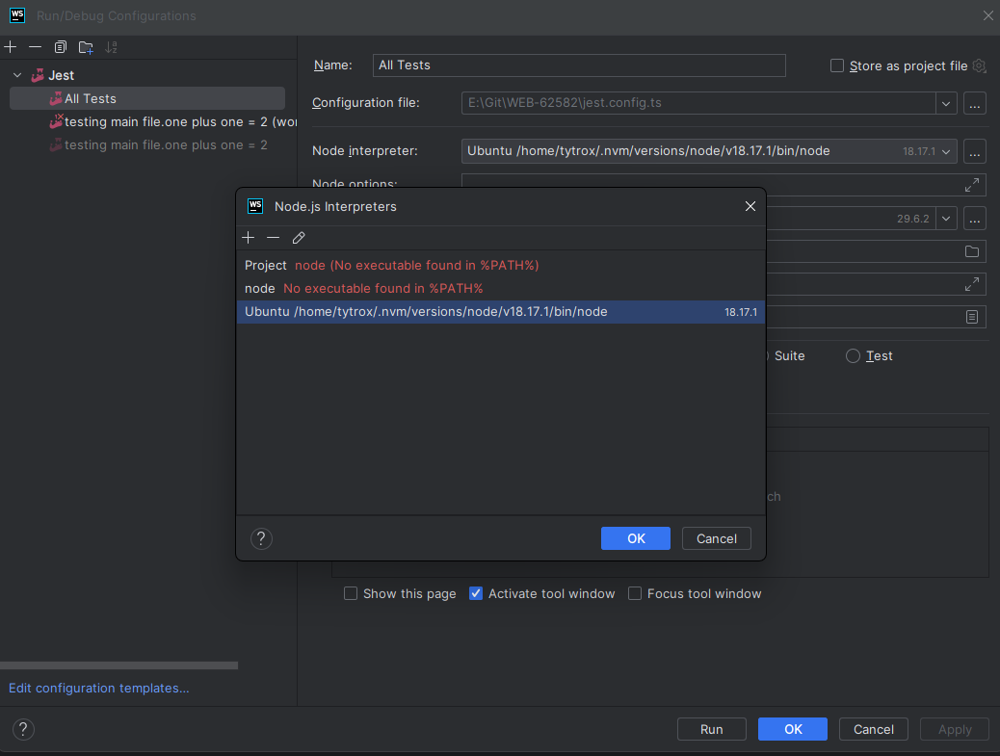
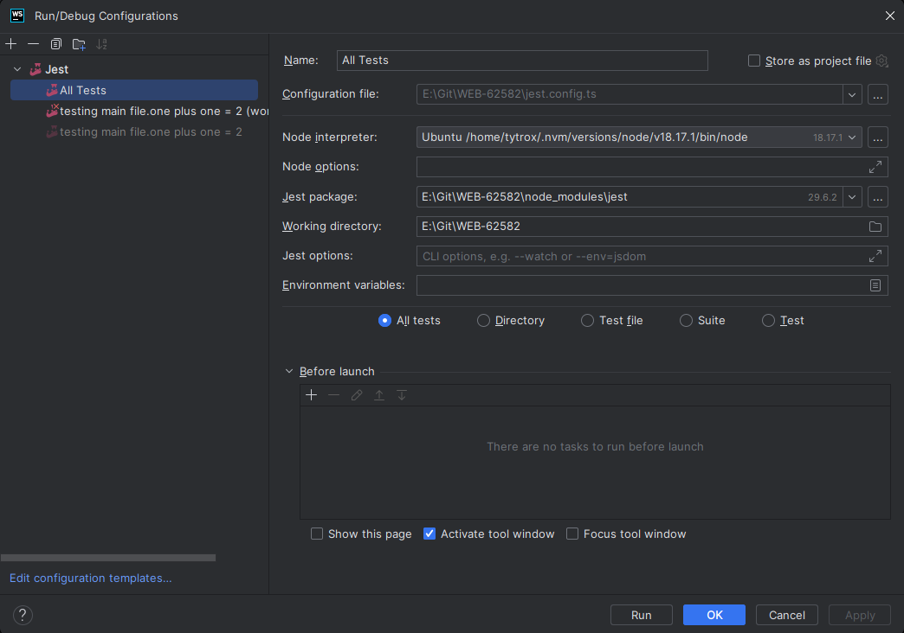
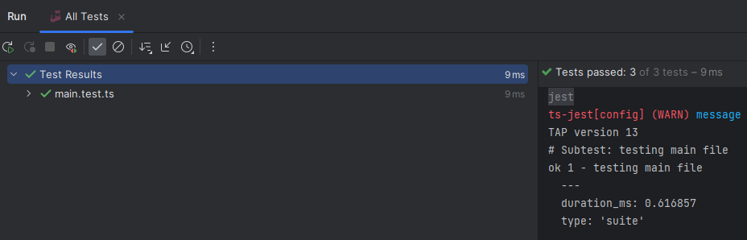
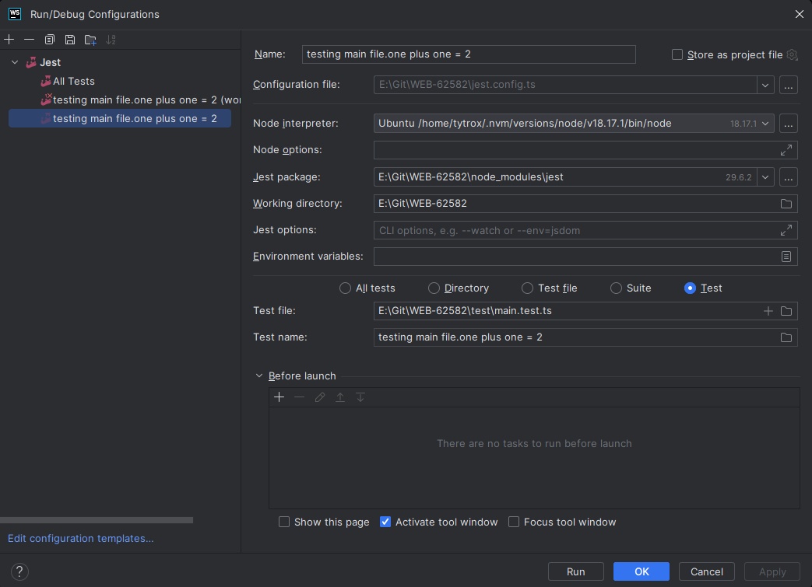
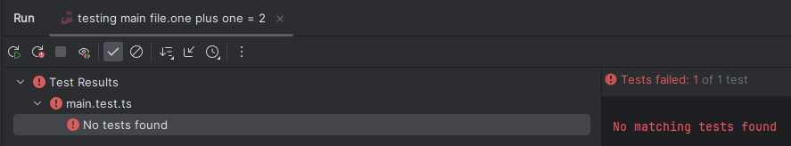
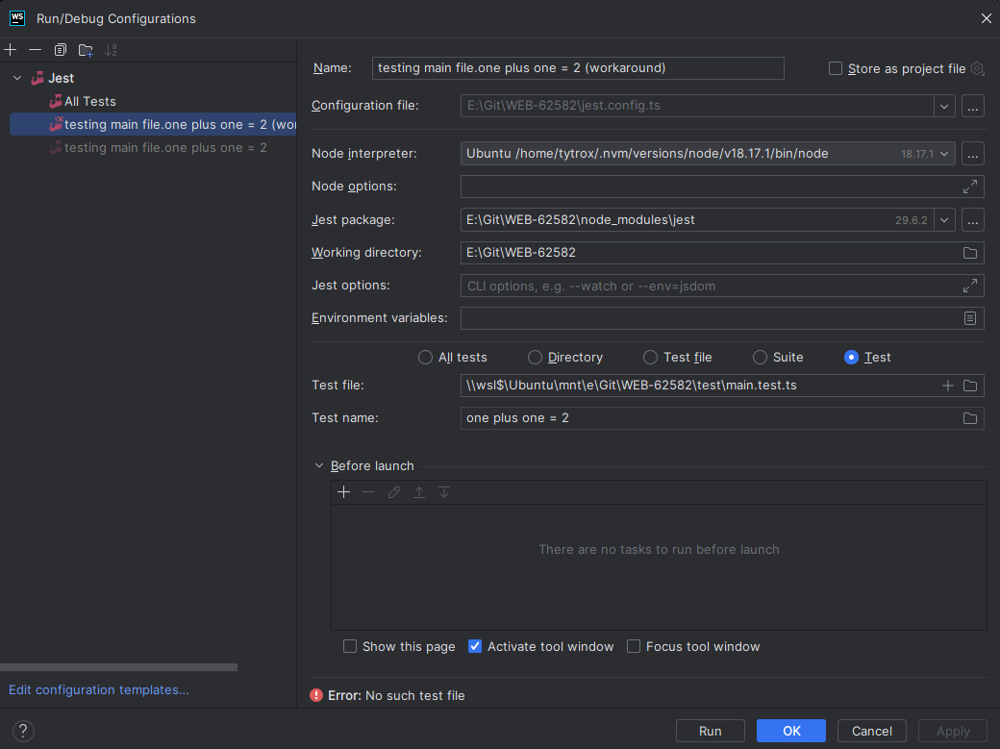
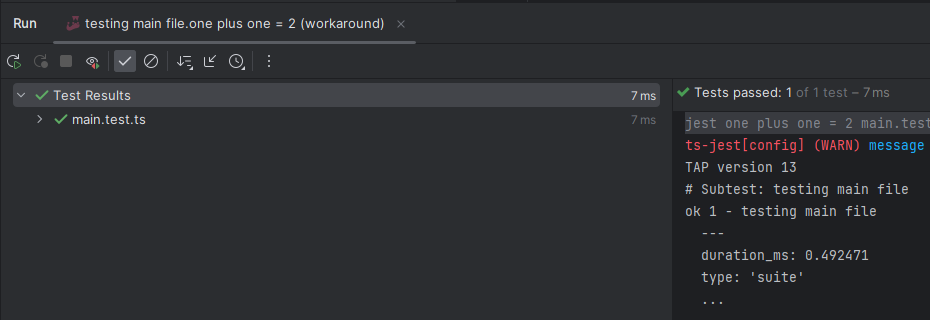

# Project to reproduce WEB-62582

https://youtrack.jetbrains.com/issue/WEB-62582/Jest-No-matching-tests-found-for-default-run-configuration-when-node-interpreter-is-in-WSL

## Fix:

Commenting out `import { describe } from "node:test"` in line 2 of [./test/main.test.ts](./test/main.test.ts)

## Dependencies:

- Make (tested on GNU Make 4.3)
- node (tested on v18.17.1)
- npm (tested on 9.6.7)

## Usage:

I will use the exact steps I took to reproduce this issue - I think the WSL distro won't matter however.

- Clone this repo into the Windows 11 file system.
- In WSL (Ubuntu) install __nvm__ with `sudo apt install nvm`
- In Ubuntu, install node 18 with `nvm install lts/hydrogen`
- In Ubuntu, navigate to this project's root directory, and run `make .test` (installs dependencies, and tests should pass)
- In WebStorm (native Windows) open this repo
- In WebStorm, configure the node interpreter (CTRL + SHIFT + A and type `node interpreter`)
- In WebStorm, navigate to [test/main.test.ts](./test/main.test.ts), and click the Run triangle next to one of the  
  tests. Assign the node interpreter in the resulting configuration to the Ubuntu Node 18 interpreter installed above.
- Run the above configuration: I expect it to fail with the error message __No matching tests found__.

I have shown screenshots of the various stages in the above process below, specifically highlighting the various configurations:

### Node interpreter configuration

### All tests configuration (WORKING)

### Auto-generated configuration (NOT WORKING)

### Workaround configuration (TEST PASSES WITH RUN CONFIGURATION ERROR MESSAGE)

